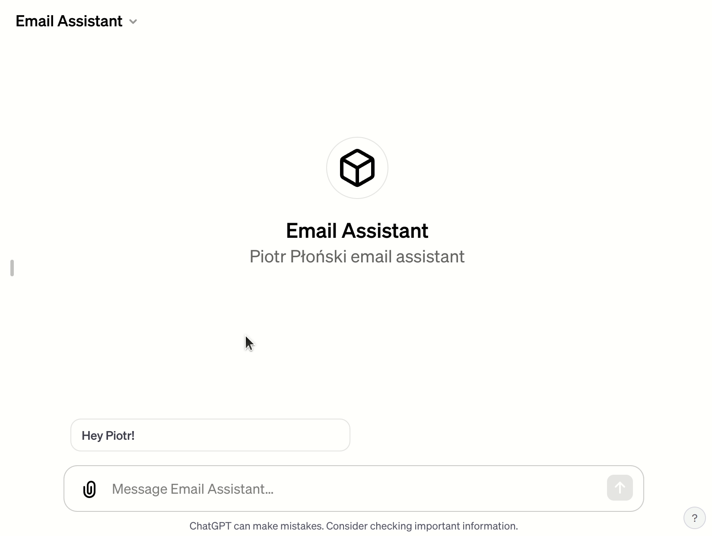
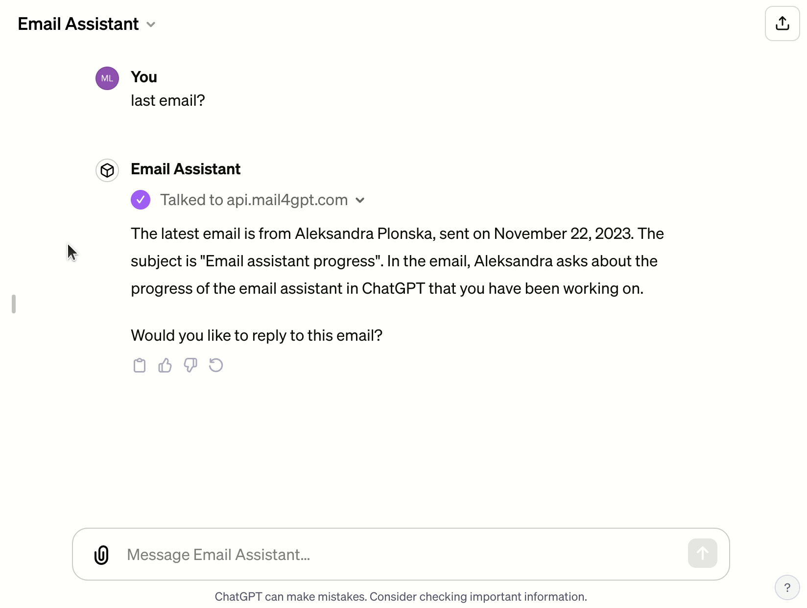

# Manage your email in ChatGPT ✉️🦜

REST API service for ChatGPT to access your email. Wouldn't it be fanstastic if you could access your email in ChatGPT? With custom GPT builder and Actions it is possible. This repository contains server that gives access to your email by REST API. The ChatGPT can interact with it. This server makes access to **only one** email address. It should be configured in `.env` file. See details below. This server gives access to email reading/sending by auth token that is created when server is starting. 

There are only two endpoints available:
- `read_email`
- `send_email`
[Here](https://api.mail4gpt.com/schema/swagger-ui/) is Swagger UI with endpoints docs.

https://chat.openai.com/share/8542aae6-74d7-47d3-bf2c-8f0c022985c3

## Read email 

Reading email in ChatGPT.

## Send email

Send response in ChatGPT.

## Configure

Please check `.env-example` to check which variables to set. You can provide **only one** email address.

OpenAPI schema is available at address: https://api.mail4gpt.com/schema/

OpenAPI schema in Swagger UI is available at address: https://api.mail4gpt.com/schema/swagger-ui/.

## 👩‍💼🐦 Connect with Us on Twitter & Linkedin

Stay up-to-date with our latest projects by following us on Twitter ([MLJAR Twitter](https://twitter.com/MLJAROfficial)) and LinkedIn ([Aleksandra LinkedIn](https://www.linkedin.com/in/aleksandra-p%C5%82o%C5%84ska-42047432/) & [Piotr LinkedIn](https://www.linkedin.com/in/piotr-plonski-mljar/)). We look forward to connecting with you and hearing your thoughts, ideas, and experiences with mail4gpt. Let's explore the future of AI together!
